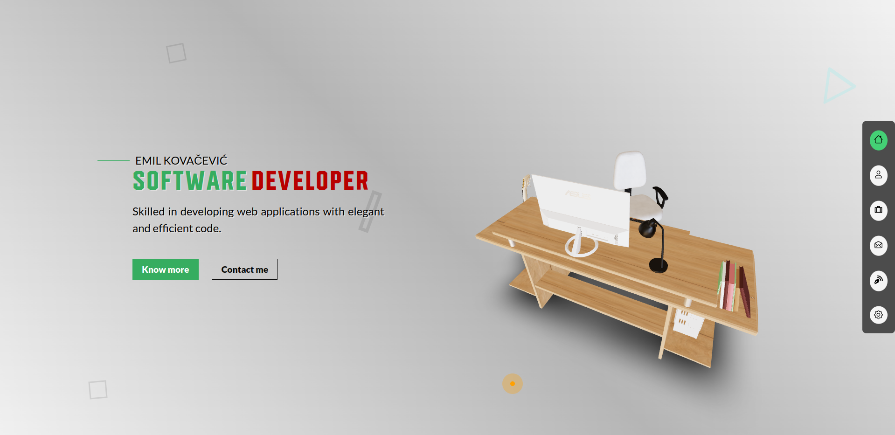

# Developer Portfolio Website

This is a personal portfolio website created using React. The website showcases my personal information, programming, 3D modeling, and animation skills.

## Features

### Home Page

The home page provides a brief introduction of myself and my skills in web animation and blender modeling. It also includes call-to-action buttons that redirect the visitor to the About Me and Contact pages.

### About Page

The About page lists my personal information and the technologies I am familiar with.

### Projects Page

The Projects page displays a list of cards containing information about some of my projects. Each project card includes a title and a link to the live project and/or source code.

### Contact Page

The Contact page includes a form that visitors can fill out to send me a message. It also includes links to my LinkedIn and Github profiles.

### Blog Page

The Blog page contains articles that showcase my technical writing skills and some of the complementary sample apps.

## Running localy

1. Clone this repository.
2. Navigate to the project directory in your terminal.
3. Run `npm install` to install all the required dependencies.
4. Run `npm run dev` to start the development server.

## Technologies Used

- Vite
- React
- Three.js
- HTML5
- Styled-Components
- TypeScript

## Credits

- [Vite](https://vitejs.dev/)
- [React](https://reactjs.org/)
- [Three.js](https://threejs.org/)
